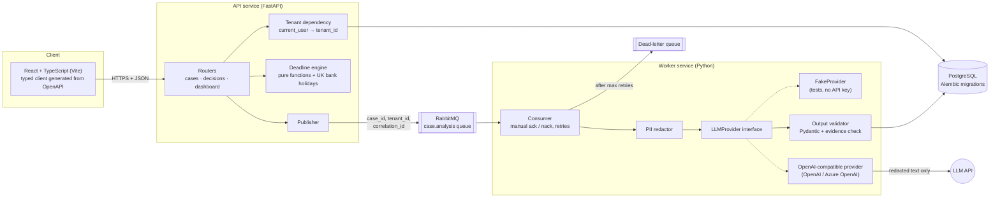
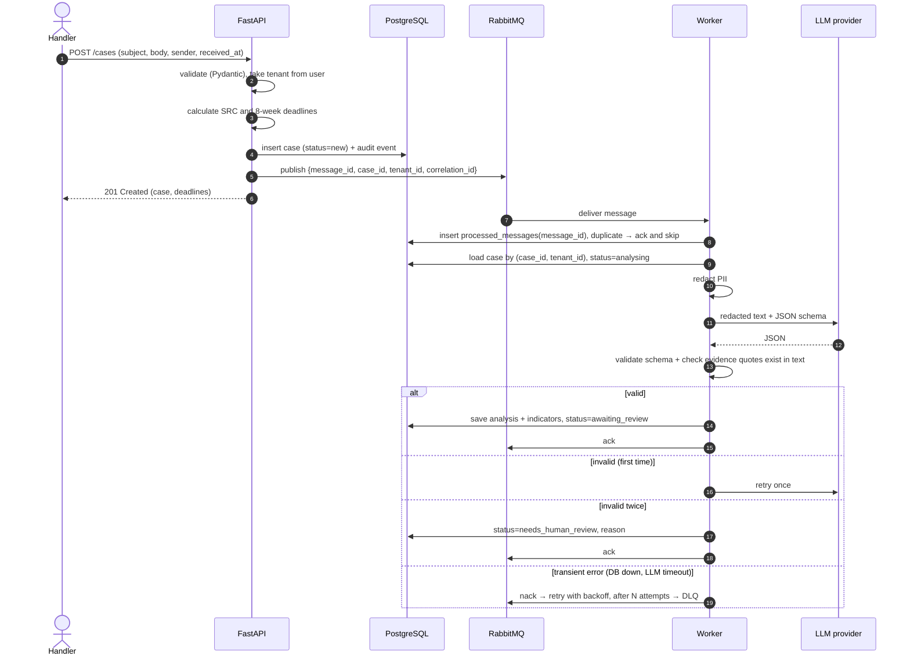

# Architecture

## Overview



## Request flow: a new complaint



## Main decisions

| Decision | Why | C# / .NET equivalent |
|---|---|---|
| **FastAPI + Pydantic v2** | Contact Web's target stack. Typed request and response models generate the OpenAPI contract automatically. | ASP.NET Core minimal APIs + DTOs + Swashbuckle |
| **SQLAlchemy 2.0 (typed `Mapped[...]`) + Alembic** | Contact Web already uses both. Alembic gives versioned migrations. | EF Core + EF migrations |
| **Separate worker process** | AI calls are slow and can fail. They must not block the HTTP request, and they must scale on their own. | `BackgroundService` / Worker Service consuming RabbitMQ |
| **Transactional outbox + relay** | The case and its job commit together; the API keeps working when the broker is down. | Outbox in MassTransit / NServiceBus |
| **RabbitMQ behind a `MessageBus` interface** | I already know RabbitMQ from .NET. The interface means Azure Service Bus is a new class, not a rewrite. | `IMessageBus` with a RabbitMQ implementation |
| **`LLMProvider` interface + fake provider** | Tests are deterministic, and anyone can run the demo without a key. OpenAI and Azure OpenAI share one implementation. | `ILlmClient` + a test double |
| **Redaction before the provider call** | The provider interface only accepts a `RedactedText` type that only the redactor creates, so unredacted text cannot reach a model without a type error. | A decorator around the client |
| **Tenant id from the auth dependency only** | One place to get right, one place to test. | Global query filter in EF Core (`HasQueryFilter`) + claims |
| **One origin: nginx serves the app and forwards /api** | No CORS configuration exists, so none can be wrong; a strict Content-Security-Policy is possible. | YARP / reverse proxy in front of an SPA |
| **API types generated from OpenAPI** | A backend change that breaks the front end fails to compile, in CI, not in a browser. | NSwag-generated client |
| **Deadlines as pure functions** | Rules like these are where bugs hide, and pure functions are easy to test at the boundaries. | Static domain service with injected `TimeProvider` |
| **Bank holidays from a JSON file** | No runtime dependency on gov.uk; reproducible tests. | Embedded resource |

## Known trade-offs (to discuss in interviews)

- **Delivery is at-least-once, not exactly-once.** Decided in milestone 4: a **transactional outbox**. The job is saved with the case in one transaction, and a relay publishes it, so the API never depends on RabbitMQ (US-1.6). A crash between publishing and marking the row published sends the job twice, which the worker absorbs through `processed_messages`. The relay polls every second: simple, at the cost of up to a second of delay. PostgreSQL `LISTEN/NOTIFY` would remove it.
- **Retries use one retry queue with per-message TTLs.** RabbitMQ only expires the message at the head of a queue, so a short delay can wait behind a longer one. Retries are rare, so this only ever delays, never loses. Per-delay queues or the delayed-message plugin would be exact.
- **Regex redaction misses some names.** It catches the sender's name and names after greetings and sign-offs, but not a third party mentioned in free text. A production system would add NER (e.g. Microsoft Presidio) and use Azure OpenAI in a UK region.
- **Prompt injection is contained, not prevented.** The complaint is fenced as data, but no prompt makes a model immune. The real controls come after it: a strict output schema with fixed enums, the word-for-word evidence check, and a person deciding everything.
- **The LLM call happens outside any database transaction.** The worker commits `analysing` first, calls the model, then saves the results in a second short transaction. Holding locks for seconds would block other work; the cost is a resumable middle state, which the worker handles.
- **Shared-schema multi-tenancy** (a `tenant_id` column) is the simplest model to start with. PostgreSQL row-level security would add defence in depth and is a stretch goal.
- **Simple token auth** with seeded users. Production would use Entra ID / OIDC.

## Repository layout (planned)

```
complaint-intake-copilot/
├── backend/
│   ├── app/
│   │   ├── api/            # routers, dependencies (auth, tenant)
│   │   ├── domain/         # deadlines, redaction, status rules, pure logic
│   │   ├── reference_data/ # bank holiday file (from gov.uk) and its loader
│   │   ├── db/             # SQLAlchemy models, session, repositories
│   │   ├── messaging/      # job contract, outbox + relay, MessageBus, RabbitMQ adapter
│   │   ├── ai/             # LLMProvider, fake + OpenAI providers, schemas
│   │   ├── worker/         # consumer (ack / retry / dead-letter), job handler, entry point
│   │   └── schemas/        # Pydantic request and response models
│   ├── migrations/         # Alembic
│   ├── tests/
│   └── pyproject.toml
├── frontend/               # React + TypeScript (Vite), served by nginx; see frontend/README.md
├── docs/
├── docker-compose.yml
└── .github/workflows/ci.yml
```
