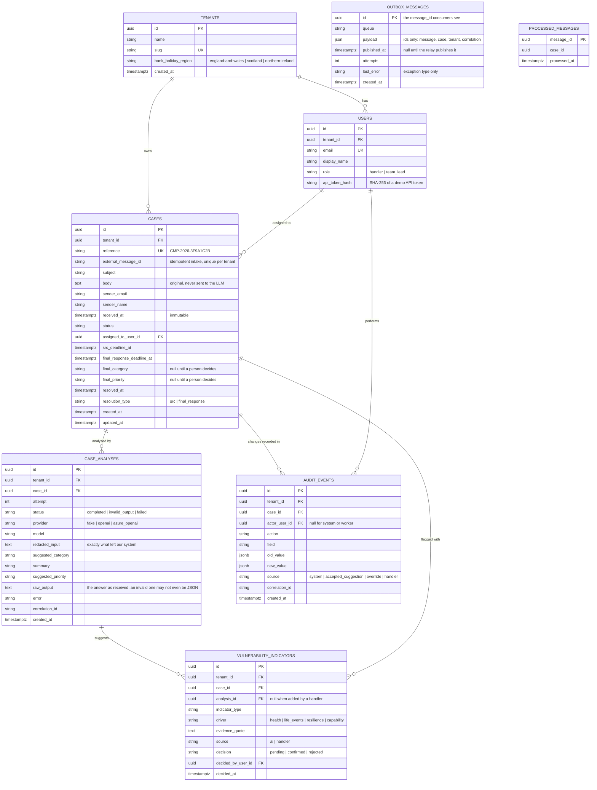
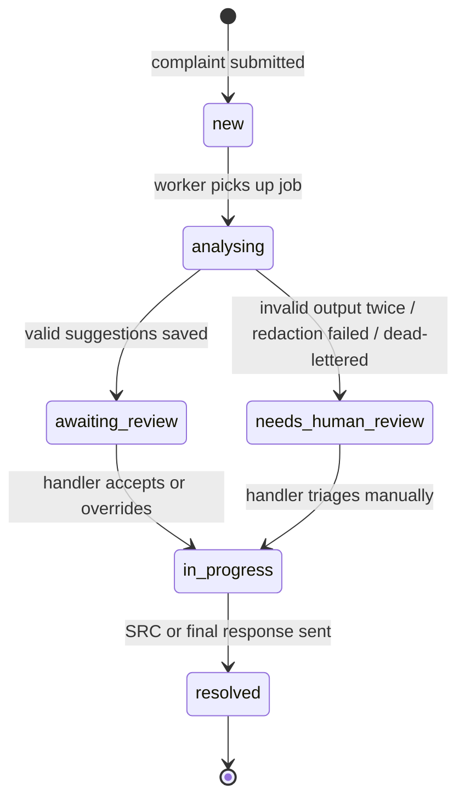

# Data model

PostgreSQL. All ids are UUIDs. All timestamps are `timestamptz`, stored in UTC.
Every table except `tenants`, `outbox_messages` and `processed_messages` has a non-null, indexed `tenant_id`. The two messaging tables are infrastructure: the tenant id travels inside the message, and the worker loads the case through the tenant-scoped repository.

## Case status (state machine)

Allowed transitions live in **one** place in code. Any other transition is rejected with `409 Conflict`.

## Enumerations

**Category** (`suggested_category`, `final_category`). This is a simplified set that I chose; it is not an official FCA taxonomy:

| Value | Meaning |
|---|---|
| `fees_and_charges` | Unexpected or disputed fees, interest, charges |
| `service_quality` | Delays, rudeness, poor communication |
| `account_administration` | Errors in account setup, statements, closures |
| `payments_and_transfers` | Failed, delayed or wrong payments |
| `lending_and_affordability` | Loans, credit cards, affordability checks |
| `fraud_and_scams` | Unauthorised transactions, APP scams |
| `advice_and_mis_selling` | Product not suitable or not explained |
| `collections_and_arrears` | Debt collection conduct, arrears handling |
| `other` | Anything else |

**Priority:** `low`, `medium`, `high`, `urgent`. If a case has any vulnerability indicator, its priority is at least `high` (rule in code, US-2.6).

**Vulnerability indicator type → FG21/1 driver**

| `indicator_type` | `driver` |
|---|---|
| `physical_illness` | health |
| `mental_health` | health |
| `disability` | health |
| `bereavement` | life_events |
| `relationship_breakdown` | life_events |
| `job_loss` | life_events |
| `financial_hardship` | resilience |
| `low_capability` (literacy, language, digital skills) | capability |

## Design notes

- **Suggestions and decisions are kept separate.** `case_analyses.suggested_*` is what the AI said. `cases.final_*` is what a person decided. Overriding a suggestion never destroys it, so we can measure AI accuracy later.
- **The original text is kept separate from the redacted text.** `cases.body` is the original. `case_analyses.redacted_input` is what was sent to the model.
- **`outbox_messages` is a transactional outbox.** The analysis job is inserted in the same transaction as the case, so a case can never exist without its job. A separate relay publishes pending rows to RabbitMQ.
- **`processed_messages` gives the worker idempotency.** The worker records each `message_id` in the same transaction as its work. A message seen before is acknowledged and skipped; a concurrent duplicate hits the primary key and is skipped too.
- **Deadlines are stored on the case** (`src_deadline_at`, `final_response_deadline_at`), calculated once at intake, so they can be indexed for the dashboard. "Business days remaining" is calculated when the case is read, because it depends on today's date.
- **Bank holidays are not a table** in v1. They come from a JSON file in the repo, taken from the gov.uk feed.
